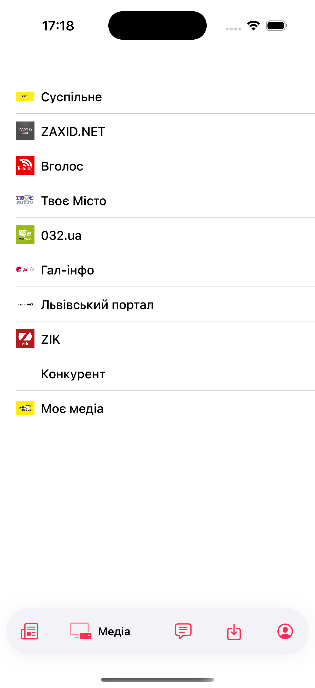
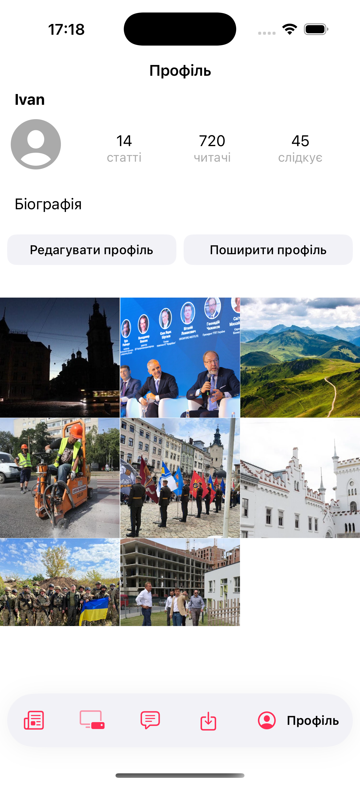

# MyNews

**MyNews** is a news application for keeping track of news in Lviv. It also allows users to suggest their own news stories, creating a community-driven platform for local updates.

## Screenshots

## Main Features

- **Browse Local News**: View the latest news updates specifically for Lviv.
- **Save News**: Save articles to read later or keep track of important stories.
- **Subscribe to Media**: Follow your favorite media sources to receive their updates.
- **Add and Remove News from Profile**: Manage your news submissions by adding or removing them from your profile.
- **Edit Profile**: Update your profile information to keep it current.

## Technologies Used

- **Swift**
- **UIKit**
- **UserDefaults** (for saving news locally)
- **Kingfisher** (for efficient image loading and caching)
- **CardTabbar** (for custom tab bar navigation)
- **Swinject & SwinjectStoryboard** (for dependency injection)
- **FeedKit** (for parsing RSS feeds)

## Contacts

**Ivan Kostyrka**  
[Email](mailto:ivan.kostyrka.work@gmail.com)  
[LinkedIn](https://www.linkedin.com/in/ivan-kostyrka-54342b324/)
